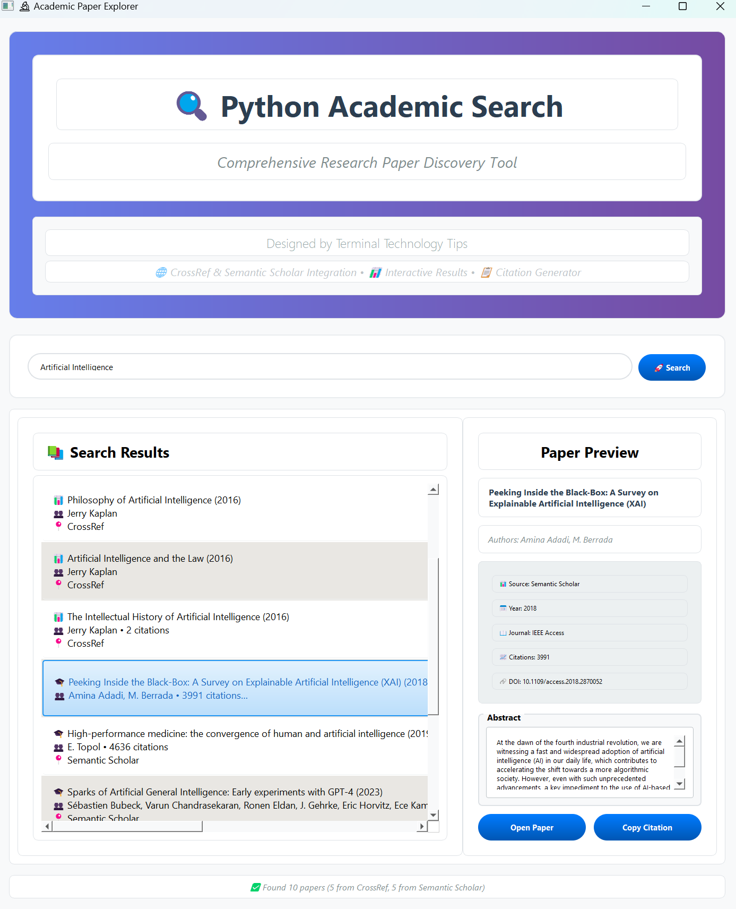

# 🔍 Python Academic Search

A comprehensive desktop application for discovering and exploring academic research papers from multiple scholarly databases.

## Features

- **Dual Database Search**: Simultaneously searches CrossRef and Semantic Scholar for comprehensive results
- **Interactive Interface**: Modern PyQt5 GUI with split-panel design for easy paper exploration
- **Rich Paper Details**: View abstracts, author information, publication year, journal, and citation counts
- **Citation Generator**: One-click citation copying in standard academic format
- **Animated UI Elements**: Smooth hover effects and responsive design for enhanced user experience
- **Real-time Search Status**: Progress tracking with detailed status updates during searches
- **Error Handling**: Robust API error handling with fallback mechanisms

## Screenshot



## Installation

1. **Clone the repository**:
   ```bash
   git clone https://github.com/your-username/python-academic-search.git
   cd python-academic-search
   ```

2. **Install dependencies**:
   ```bash
   pip install -r requirements.txt
   ```

3. **Run the application**:
   ```bash
   python ScholarlyScraper_main.py
   ```

## Usage

1. **Search for Papers**: Enter research topics like "machine learning", "climate change", or "quantum computing" in the search box
2. **Browse Results**: Click on any paper in the results list to view detailed information
3. **View Details**: The right panel shows comprehensive paper information including abstracts and metadata
4. **Open Papers**: Click "Open Paper" to access the full paper via DOI or URL
5. **Copy Citations**: Use "Copy Citation" to copy formatted citations to your clipboard

## Requirements

- Python 3.6+
- PyQt5 5.15.0+
- requests 2.25.0+

See `requirements.txt` for complete dependency list.

## API Sources

- **CrossRef**: Academic publishing metadata and DOI resolution
- **Semantic Scholar**: AI-powered academic search with citation data

## Contributing

Contributions are welcome! Please feel free to submit a Pull Request.

## License

This project is designed for educational and research purposes.

---

**Designed by Terminal Technology Tips**
